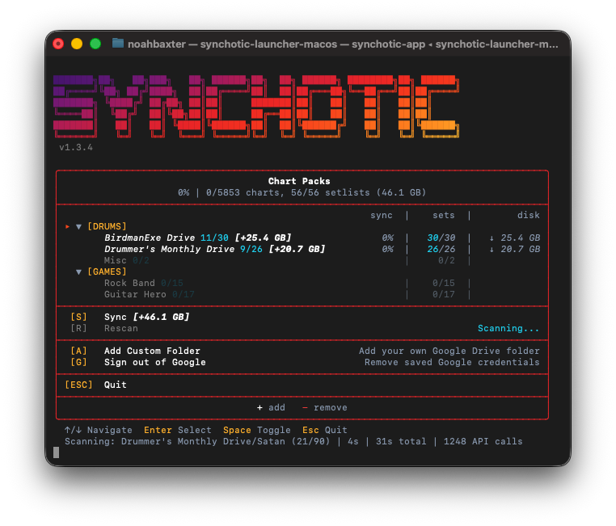

# Synchotic

A Clone Hero chart downloader. Browse community chart packs, pick what you want, and sync.



## Download

**[Download the launcher here](../../releases/tag/launcher-v1)**

- **Windows:** Download `synchotic-launcher.exe` and run it
- **macOS:** Download `synchotic-launcher-macos`. macOS blocks apps from unknown developers, so open Terminal and run:
  ```
  cd ~/Downloads && chmod +x synchotic-launcher-macos && xattr -d com.apple.quarantine synchotic-launcher-macos
  ```
  Then double-click to run.

The launcher automatically downloads and updates the app.

## How It Works

1. Launch the app - it fetches the latest chart pack list automatically
2. Pick which chart packs you want (toggle with **Space**)
3. Press **S** to Sync - downloads enabled charts, removes disabled ones

Charts download to a `Sync Charts` folder next to the app.

## Controls

| Key | Action |
|-----|--------|
| **↑↓** or **1-9** | Navigate / jump to item |
| **Enter** | Open pack settings |
| **Space** | Toggle pack on/off |
| **S** | Sync all |
| **Tab** | Switch view (Size / Files / Charts) |
| **A** | Add custom Google Drive folder |
| **G** | Sign in/out of Google |
| **Esc** | Back / Quit |

## Features

- **Smart sync** - only downloads what's new or changed
- **Setlist filtering** - pick exactly which setlists you want from each drive
- **Custom folders** - add your own Google Drive folders
- **Sign in to Google** - optional, gives you faster downloads with your own quota
- **Auto-extract** - handles .zip, .7z, and .rar archives automatically

## Troubleshooting

### Downloads fail with path errors (Windows)

Windows blocks paths over 260 characters. To fix:

1. Open Registry Editor (`regedit`)
2. Go to `HKEY_LOCAL_MACHINE\SYSTEM\CurrentControlSet\Control\FileSystem`
3. Set `LongPathsEnabled` to `1`
4. Restart your computer

### Where are my charts?

In the `Sync Charts` folder, next to where you ran the app.

### Where are logs?

`.dm-sync/logs/` next to the app. Each day gets its own log file.

---

## For Developers

<details>
<summary>Click to expand</summary>

### Running from Source

```bash
pip install -r requirements.txt
python sync.py
```

### Building

Builds are automatic via GitHub Actions on push to main.

```bash
pip install pyinstaller
pyinstaller --onefile --name synchotic sync.py
```

### Local Testing (Windows builds from WSL/macOS)

For testing Windows builds locally without pushing to GitHub:

```bash
# Build launcher + app, copy to a test folder
./build.sh dev /mnt/t/TEST      # WSL example
./build.sh dev ~/Desktop/test   # macOS example
```

Then run the launcher with dev flags:

```
# Windows (in target folder)
synchotic-launcher.exe --dev           # Replace app, keep settings
synchotic-launcher.exe --dev --clean   # Fresh install (nuke .dm-sync)

# macOS
./synchotic-launcher-macos --dev
./synchotic-launcher-macos --dev --clean
```

**How it works:**
- `--dev`: If `app-windows.zip` (or `app-macos.zip`) exists, extracts it and deletes the zip. If no zip, uses existing `_app` folder.
- `--clean`: Nukes entire `.dm-sync/` folder first (fresh install).
- Subsequent `--dev` runs without a new zip just use the existing app.

### Manifest Updates

The manifest auto-updates daily via GitHub Actions.

**Manual trigger:** Actions → "Update Manifest" → Run workflow

**Setup:**
1. Create OAuth credentials at [Google Cloud Console](https://console.cloud.google.com/apis/credentials)
2. Run `python manifest_gen.py` locally to generate `token.json`
3. Add GitHub Secrets: `GOOGLE_CREDENTIALS`, `GOOGLE_TOKEN`, `GOOGLE_API_KEY`

</details>
