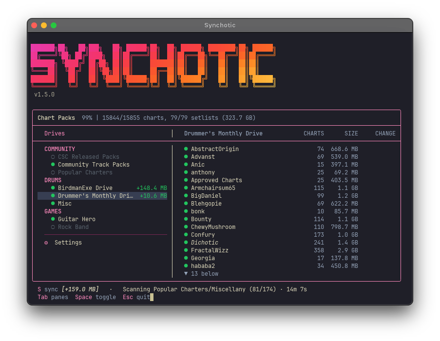

# Synchotic

Synchotic is a tool to automate the downloading and updating of charts from Google Drive for rhythm games like Clone Hero and YARG. Pick from a curated selection of popular drives and setlists (or add your own), press sync, wait, and enjoy the best charts the community has to offer! Ever been confused about which charts people actually need to play online? This is not a bad place to start.



## Install

**[Download the launcher](../../releases/tag/launcher-v1.3)**

| Platform | File | Then |
|----------|------|------|
| Windows | `synchotic-launcher.exe` | Keep it anywhere. |
| macOS | `Synchotic-launcher-macos.zip` | Unzip and drag `Synchotic.app` to Applications. |
| Linux | `Synchotic-launcher-x86_64.AppImage` | Keep it anywhere, mark it executable. |

Double-click the launcher and it'll run automatic updates on Synchotic. The first time you run it'll ask where your library goes and how to authenticate downloads.

## Use

In the left column are chart **drives** that contain **setlists** in the right column. To enable/disable any drive or setlist press space. To jump into the setlists list press tab on a drive.

To sync press S. This will download, update and delete files to match exclusively the setlists you've selected.

## Library

Synchotic keeps one local folder in sync with the drives and setlists you choose. **BE WARNED:** any unmanaged files in this folder **WILL BE DELETED** on sync. Pick an empty folder or a previous sync folder or face the consequences...

Change it anytime under **Settings > Library**.

## Download modes

Google prevents anonymous downloads for most popular large chart packs. To get around this limitation you can choose to authenticate Synchotic with your Google account in a few different ways.

- **Sign in with rclone (easiest):** sign in to your Google account to give rclone read-only access and you're done. Google will retire this option sometime in 2026.
- **Bring Your Own Credentials (best):** setup takes ~10 minutes and is a bit confusing, but you get parallel threading, which makes large downloads like an initial one much faster. See [docs/byoc.md](docs/byoc.md).
- **No sign-in:** Google will block certain downloads, mostly game rips and other large chart packs.

Change it under **Settings > Account > Mode**.

## Troubleshooting

**Where are logs?**

| Windows | macOS | Linux |
|---|---|---|
| `%LOCALAPPDATA%\Synchotic\Logs` | `~/Library/Logs/Synchotic` | `~/.local/state/synchotic` |

**macOS security warning.** This shouldn't happen, but if it does let me know, then right-click the app, **Open**, then **Open** again.

<details>
<summary><strong>For developers</strong></summary>

### Run from source

```bash
pip install -r requirements.txt
python sync.py
```

Put `GOOGLE_API_KEY=...` in a `.env` at the checkout root. Without it Google refuses the scan and no drives list. `unrar` is needed for .rar extraction.

`python sync.py --first-run` runs against a throwaway empty install, to see what a new user sees. Your `credentials.json` is copied in unless you pass `--no-creds`.

### Build

GitHub Actions builds on push to `main`. Locally:

```bash
./build.sh                       # app only
./build.sh launcher              # launcher only
./build.sh mac                   # Synchotic.app, installed to /Applications
./build.sh dev ~/Desktop/test    # both, copied to a test folder
```

### Test a build

After `build.sh dev`, run the launcher from the target folder:

```bash
./synchotic-launcher-macos --dev           # replace app, keep settings
./synchotic-launcher-macos --dev --clean   # fresh install, wipes .dm-sync
```

`--dev` uses a local `app-macos.zip` if present, otherwise the existing `_app` folder.

</details>
